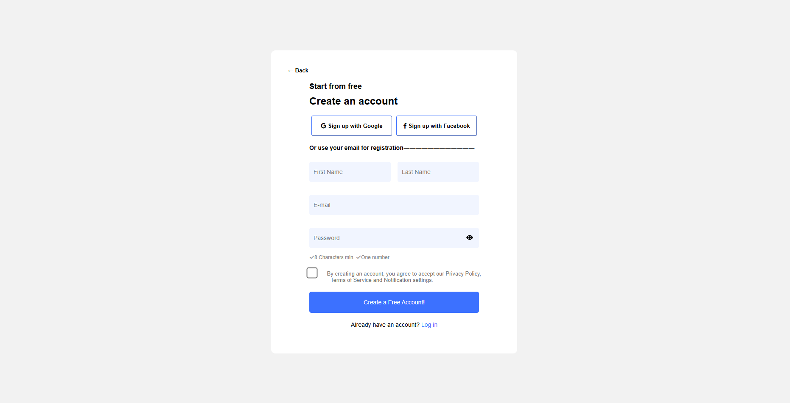
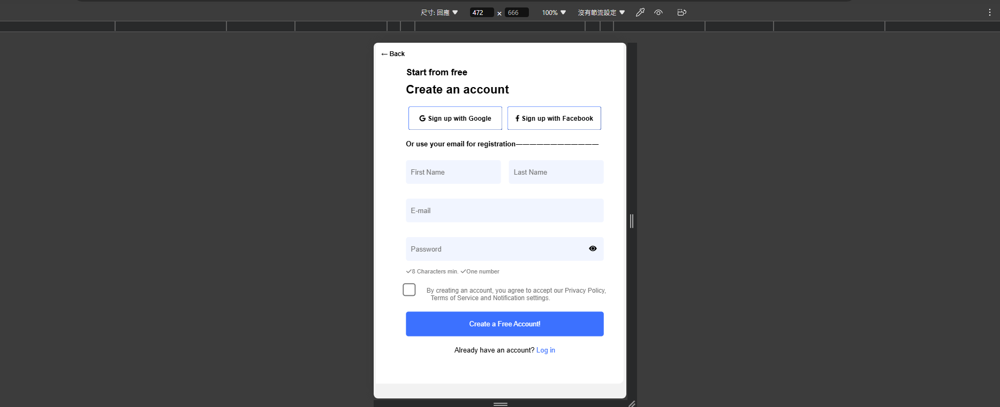

### README.md

```markdown
# Register Page

This project is a responsive registration page designed to showcase front-end development skills. The page includes form validation, social login buttons, and password visibility toggle with enhanced styling.

## Features

- Responsive design
- Social login buttons for Google and Facebook
- Real-time form validation
- Password visibility toggle with an icon
- Enhanced password validation (minimum 8 characters and at least one number)

## Preview




## Technologies Used

- HTML
- CSS
- JavaScript

### Release Notes

2024/7/10 
  1.HTML寫出主要註冊網站架構
  2.CSS 做介面排版
2024/7/11
  1.於html用form寫出當input寫入required時，input未填寫或未勾選同意建立帳號政策，按下submit跳出error message
  2.優化CSS(container 比例、大小 Back鍵位置、大小)
2024/7/12
  1.Javascript input未填寫的錯誤錯誤訊息
  2.優化CSS(表單input、submit button的比例、大小)
2024/7/13
  1.Javascript用於呼叫顯示隱藏密碼、設定密碼條件
  2.優化CSS(social-login button的比例、大小)
2024/7/14
  1.優化CSS(policy agreement checkbox的位置、比例)
  2.將Google&Facebook icon寫入social-login button
### Usage

To run the project, open the `index.html` file in a web browser or use a local server setup like XAMPP, WAMP, or MAMP.

Alternatively, you can open the project in Visual Studio Code and use the Live Server extension to run the project.

### Project Structure

register-page/
│
├── register.html          # The main HTML file
├── styles.css             # CSS styles
├── javascript.js          # JavaScript file for form validation and interactions
├── register.png           # Screenshot of the webpage
├── register_phone.png     # Screenshot of the webpage on mobile
└── README.md              # Project README file

### Form Validation

The form includes validation for the following:

- All fields are required.
- Password must be at least 8 characters long and include at least one number.

If the form is submitted with missing or incorrect information, an error message will be displayed.

### Password Toggle

You can toggle the visibility of the password by clicking the eye icon. When the password is visible, the input field will expand to 400px.

### Contributions

Contributions are what make the open source community such an amazing place to learn, inspire, and create. Any contributions you make are **greatly appreciated**.

1. Fork the Project
2. Create your Feature Branch (`git checkout -b feature/AmazingFeature`)
3. Commit your Changes (`git commit -m 'Add some AmazingFeature'`)
4. Push to the Branch (`git push origin feature/AmazingFeature`)
5. Open a Pull Request

### Contact

Eddie Huang - eh099813l@gmail.com

Project Link: [https://github.com/your_username_/register-page](https://github.com/your_username_/register-page)
```

